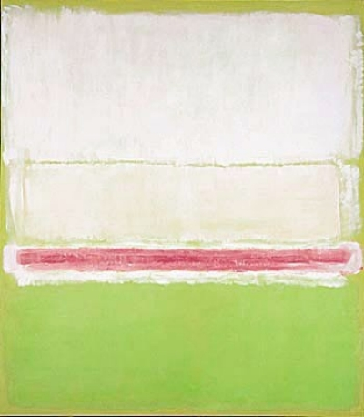

# 🎨 Rothko: AI-Infused Creative Studio 🖌️
Drawing inspiration from the boundless emotion and fluidity of Mark Rothko's art, Rothko is an AI-driven creative platform designed to bridge the gap between your unique artistic vision and the limitless potential of artificial intelligence.

## 🖼️ Who was Mark Rothko?
Mark Rothko (1903-1970) was an eminent American painter and a major figure of the Abstract Expressionist movement. His distinctive artistry, characterized by luminous color fields against contrasting backgrounds, embodied profound emotional and spiritual themes.

  

  Mark Rothko, No. 2 (No. 7 and No. 20), 1951 (alternatively dated to 1950), Collection of Mrs. Paul Mellon, Upperville, Virginia

## 🔮 Emotion Recognition and Perception Transformation
In homage to Mark Rothko's ability to convey raw emotion through his art and Aldous Huxley's theories on altered perception, our AI has been cultivated to perceive the emotional nuances of your creative journey and to catalyze shifts in your artistic perspective. The AI intuitively grasps the soul of your artistic style and offers suggestions that not only enrich your work but also stimulate new channels of creative thought.

## 🧩 Advanced Pattern Recognition
Utilizing sophisticated pattern recognition algorithms, Rothko's AI discerns patterns and themes in your ongoing canvas work. This understanding of your style and preferences allows the AI to offer tailored suggestions that align seamlessly with your unique artistic vision.

## 🌍 Adaptive Environmental Sensitivity
Our AI also boasts the capability to adapt based on environmental factors. By modifying the identified patterns in response to the surrounding environment, your artwork can organically evolve with the world around it. Looking ahead, we're working on integrating APIs to further refine this environmental adaptation.

## 🎁 Tailored Suggestions
Rothko's AI offers suggestions derived from the current state of your canvas. These propositions are tuned to both your artistic style and the surrounding environment, offering you a curated set of unique and personalized ideas to enrich your artwork.

Join us on this exciting and enlightening artistic journey, and let's co-create stunning art with Rothko!
